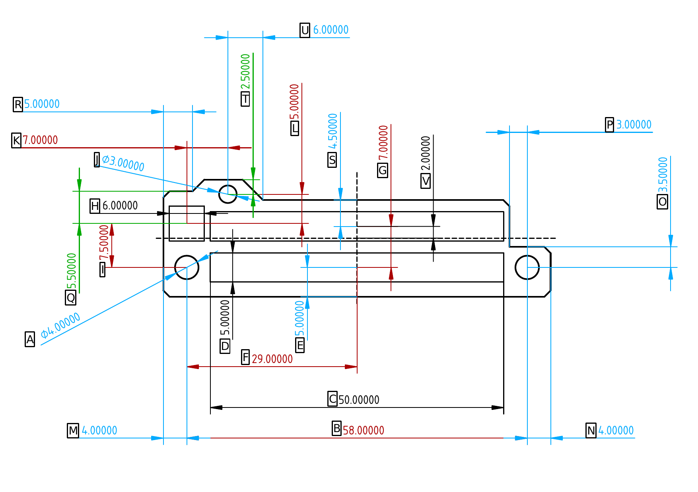
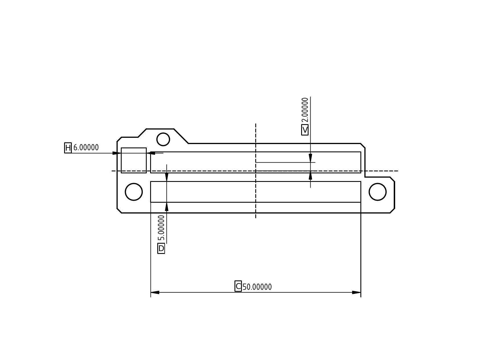
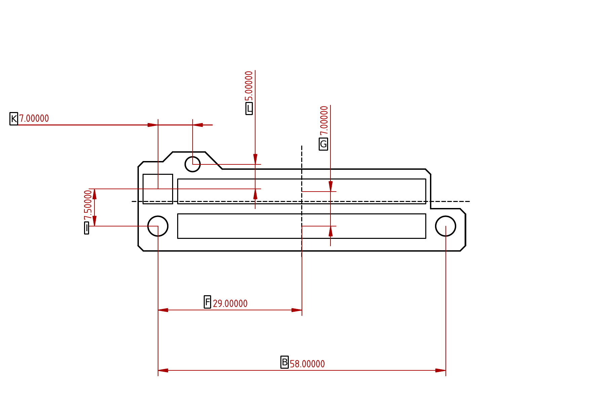
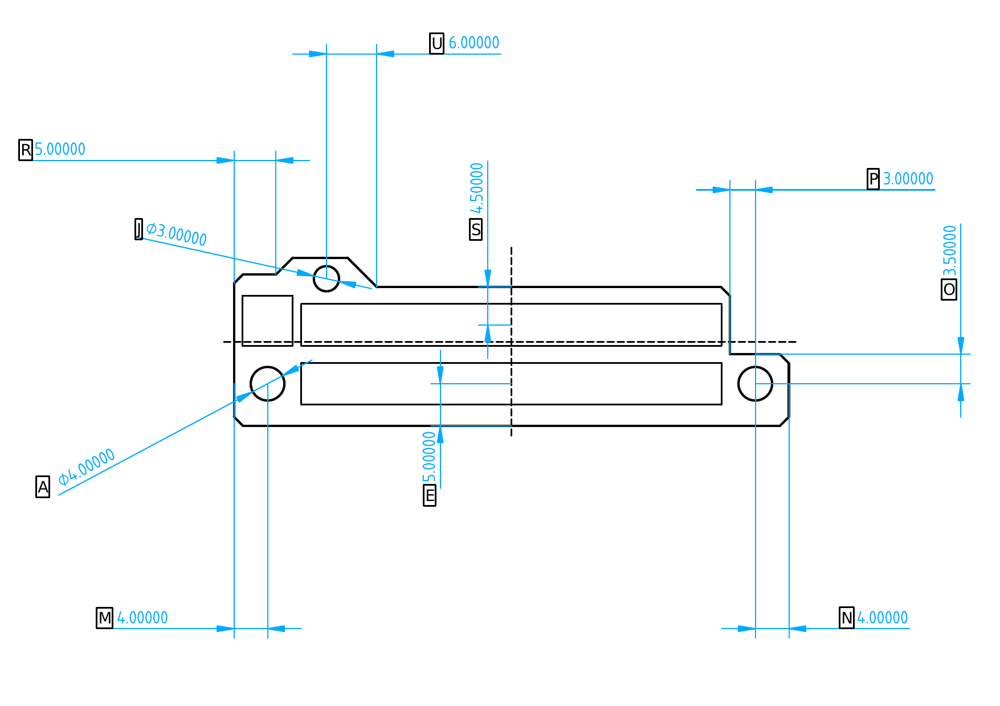
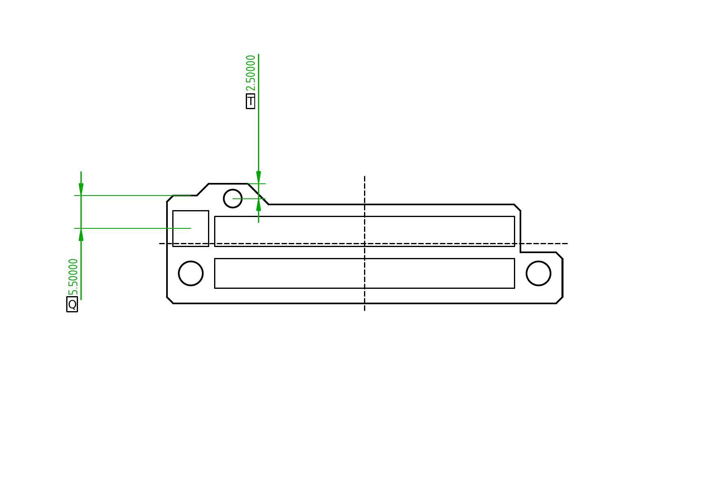

Pi Case 40 GPIO PCB
===================

A replacement PCB (and a GPIO sticker) for the Pi Case 40, that fixes the reversed GPIO Issue.

 - The PCB can be located under PiCase40/. It includes all the schematic symbols, footprints and 3D shapes it uses, in project-specific libraries, located under Library/.
 - sticker.svg is the GPIO sticker.
 - PCBReference.FCStd contains the PCB dimensions and component placements, as well as technical drawings for all the important size and space restrictions that need to be taken into consideration when modifying the PCB or creating a new one.
 - TutorialDrawings/ contains the technical drawings from PCBReference.FCStd exported as png images, used later in the [Tutorial](#Tutorial) section.

## A small update - 13.02.2022

I am sorry for the enourmous delay, but I am not dead and neither is the project. In-fact, it's this close to a finished, ready to purchase sticker and a PCB.

- I have received a new sticker and I will test it tomorrow, but I have a feeling this one would fit. Then I'd update the README.

- I may have found a board house that can print and assemble the PCB. Ideally, if they can suggest a way the sandwitched PCB isn't needed, it would be even better. I will update as soon as I have anything concrete.

Table of contents
=================

<!--ts-->
   * [Pi Case 40 GPIO PCB](#pi-case-40-gpio-pcb)
   * [Table of contents](#table-of-contents)
   * [TODO](#todo)
      * [PCB TODO](#pcb-todo)
      * [Sticker TODO](#sticker-todo)
   * [Placing an order](#placing-an-order)
      * [Order a PCB](#order-a-pcb)
      * [Order a Sticker](#order-a-sticker)
   * [Modifying](#modifying)
      * [Modifying the PCB](#modifying-the-pcb)
      * [Modifying the Sticker](#modifying-the-sticker)
   * [Created with Free Software](#created-with-free-software)
   * [LICENSE](#license)
   * [Support my work](#support-my-work)
   * [Community repo](#community-repo)
<!--te-->

TODO
====

PCB TODO
--------

- Wait to hear back from the board house and go from there.

Sticker TODO
-------

1. Test the new sticker
2. Update the README appropriately, depending on whether the sticker fits or not.

Placing an order
================

Order a PCB
-----------

Order a Sticker
---------------

Modifying
========

Modifying the PCB
-----------------

In-case you want to modify this PCB, or create a new one from scratch, there are certain important dimensions you must know about:

As you can see, there are 4 different types of dimensions, marked in black, red, green and blue.

To make things easier to see, let's show each different type of dimensions on their own, when talking about them:

Black (Informative Dimentions) - You can't really change those, as they show typical component sizes, however some other dimensions may depend on them:

 - H: Width and Depth of the body of a typical tactile switch.
 - D: Depth of the body of a typical pin header (both male and female)
 - C: Width of the body of a typical pin header (both male and female)
 - V: V is an exception, as it doesn't show a component's dimension, instead it shows how far the vertical center of the male header is, from the grid's 0,0. This is to help you center everything.

Red (Exact Dimensions) - Dimensions that must be exactly as shown, or things won't fit:

 - B: Horizontal center to center distance of the mount holes - 58mm. Same as the center to center distance of the Raspberry Pi 4 mount holes and Pi 40 Case mount posts.
 - F: Horizontal center to center distance between the mount holes and the female pin header - 29mm.
 - I: Vertical center to center distance between the left mount hole and the tactile switch body - 7.5mm.
 - L: Vertical center to center distance between the tactile switch body and the top mount hole - 5mm.
 - K: Horizontal center to center distance between the tactile switch body and the top mount hole - 7mm.
 - G: Vertical center to center distance between the female and male pin headers - 7mm.

Blue (Restrictive Dimensions) - Dimensions that don't have to be as shown, but still have a limit as they depend on other dimentions and component placements:

 - A: Main mount holes diameter - 4mm. Must be between 4mm (bottom case mount posts' inner diameter) and 6mm (bottom case mount posts' outer diameter), so the PCB rests on the the posts, but allows the raised lip around the screw holes to go through.
 - E: Female header center to bottom board edge - 5mm. Must be between 5mm (half the thickness of a typical female pin header (dimension D:) + about 2.5mm for its SMD pads and some wiggle room) and 7mm as the inner board wall is 7mm away.
 - J: Top mount post hole diameter - 3mm. Must be less than 6mm (top mount post diameter) and not less than 2.5mm (top mount post inner diameter/screw hole diameter), so the PCB rests on the post but allows for the screw to go through.
 - O: Right mount hole center to board edge above it - 3.5mm. Must be bigger than half of dimension A to allow for some lip around the whole and not more than 3.54mm as Raspberry Pi's PoE header starts 3.54mm above the right screw hole center
 - P: Space for Pi's PoE Header - 3mm. Must be at least 2.6mm as the Pi's PoE header is 5.2mm by 5.2mm square on the same vertical axis as the right mount hole, but small enough to allow some lip around the male header for traces.
 - R: Cosmetic board cutout width - 5mm. If you are going to have this cutout, it must be at least as big as dimension M and less than K - J / 2 to allow for some lip to the left of both the tactile switch body and the top screw hole.
 - U: Case radiator support clearance - 6mm. It must be more than half of J to allow for some lip around the screw hole and depending on the degrees of the angle, watch out for the radiator support. Same X axis as the mount hole, 7mm to the right from its center the radiator support is reaches the height at which the PCB is mounted.
 - S: Male header center to top board edge - 4.5mm. It must be more than half of D to allow for some lip around the header, but not more than 4.5mm as the radiator starts about 4.5mm above where the center of your male header would be.
 - N: Right mount hole center to right board edge - 4mm. It must be more than half of A, to allow for some lip around the screw hole, but not more than 4.95mm as the Pi's Ethernet port starts there. Warning: If not the same as M, it would shift your board's horizontal center, making it difficult to center the board and position components relative to the center, without you having to find the new one yourself.
 - M: Left mount center center to left board edge - 4mm. It must be more than half of A, to allow for some lip around the screw hole, but not more than 5mm as this is where the inside of the left case wall starts. Warning: If not the same as N, it would shift your board's horizontal center, making it difficult to center the board and position components relative to the center, without you having to find the new one yourself.

Green (Loose Dimensions) - Dimensions that you can set to whatever you like (within reason) as every board edge or Pi component that is tall enough to interfere, are at least a couple of cm away:

 - Q: Button center to top board edge - 5.5mm. As long as it's big enough to leave some lip around the switch body for its SMD pads, you can have it couple of cm if you like.
 - T: Top mount hole center to top board edge - 2.5mm. As long as you leave some lip around the hole, you can have it couple of cm if you want, but if you have the slanted edge on the right, keep in mind U.

All corners are 135 degrees, and the length of all of them except for the two on top around the top mount hole is 1.5mm.

Modifying the sticker
---------------------

Created with Free Software
==========================

Everything has been created with [Free Software](https://www.gnu.org/philosophy/free-sw.en.html).

 - The PCB has been created with [KiCAD](https://kicad.org/) and [FreeCAD](https://www.freecadweb.org/) + the [KiCad StepUp Workbench](https://github.com/easyw/kicadStepUpMod)
 - PCBReference.FCStd has been created with [FreeCAD](https://www.freecadweb.org/)
 - The Sticker has been created with [Inkscape](https://inkscape.org/)
 - The README has been written with [Vim](https://www.vim.org/)

LICENSE
=======

Unless otherwise noted, everything is released under [CERN Open Hardware Licence Version 2 - Strongly Reciprocal](https://ohwr.org/project/cernohl/wikis/Documents/CERN-OHL-version-2).

Support my work
===============

If you find this project useful, please, consider supporting my work, using the Sponsor button in the top right.

Community repo
==============

Don't forget to check the community repo over at [https://github.com/Pi-Case-40-Community/PiCase40](https://github.com/Pi-Case-40-Community/PiCase40) that contains the community's creations for the Pi Case 40.

